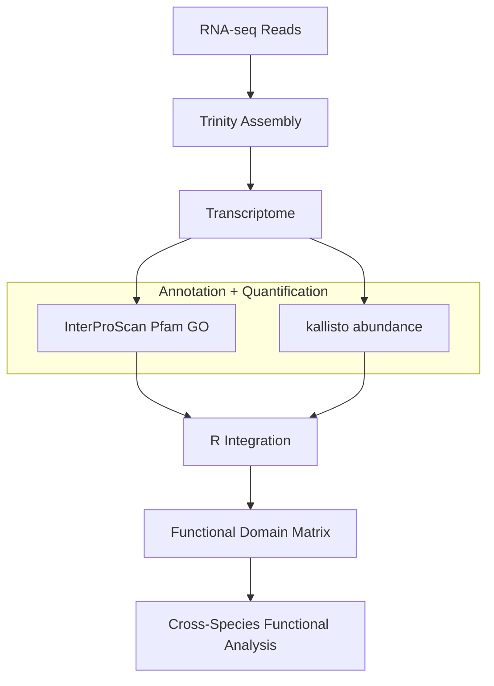

<p align="center">
  
</p>

# PLANT — ParaLLeL ANNotatioN of Transcriptomes

### Mapping transcriptomes into functional protein domain space for cross-species comparison

PLANT is a comparative transcriptomics workflow that integrates **protein domain annotation** with **RNA-seq expression quantification** to construct functional expression profiles across species.

The framework treats **evolutionary divergence as a treatment condition**, allowing transcriptomes from different species to be compared through the **distribution of functional protein domains** rather than direct gene homology.

## 🌐 Live Demo
https://asifali-bio.github.io/plant/

---

## Table of Contents

- [Overview](#overview)
- [Pipeline Overview](#pipeline-overview)
- [Conceptual Framework](#conceptual-framework)
- [Mathematical Interpretation](#mathematical-interpretation)
- [Normalization Strategy](#normalization-strategy)
- [Primary Use Case](#primary-use-case)
- [Input Requirements](#input-requirements)
- [Running the Analysis](#running-the-analysis)
- [Future Development](#future-development)
- [Summary](#summary)

---

## Overview

PLANT merges two complementary sources of information:

| Data source | Information captured |
|-------------|---------------------|
| InterProScan | Functional identity (Pfam domains, GO terms) |
| kallisto | Transcript abundance |

By combining these datasets, PLANT generates a **domain-weighted functional expression matrix** describing the distribution of biological functions within each transcriptome.

This representation enables **comparative functional genomics across species**, even when orthology relationships are unclear.

---

## Method Overview



The workflow consists of the following stages:

1. **RNA-seq assembly**  
   Transcriptomes are assembled from sequencing reads using **Trinity**.

2. **Functional annotation**  
   Predicted proteins are annotated using **InterProScan**, identifying Pfam domains and Gene Ontology terms.

3. **Expression quantification**  
   Transcript abundance is estimated using **kallisto**.

4. **Data integration**  
   Custom **R scripts** merge annotation results with abundance estimates to compute domain-level expression distributions.

The resulting dataset represents a **matrix of functional annotations weighted by transcript abundance**.

---

## Conceptual Framework

PLANT treats **evolutionary divergence as a treatment condition**.

Traditional comparative genomics focuses on orthologous gene comparisons. In contrast, PLANT compares **functional domain abundance profiles**, allowing biological functions to be compared even when gene homology is uncertain.

```
Functional annotation
(InterProScan)

Red crayon   → Pfam domain A+C
Green crayon → Pfam domain B
Blue crayon  → Pfam domain C


Expression quantification
(kallisto)

3 Red crayons
5 Green crayons
1 Blue crayon


PLANT integration

Domain abundance profile:

Pfam A  ███
Pfam B  █████
Pfam C  ████
```

Each species therefore becomes a **functional domain distribution**, allowing
cross-species comparison without requiring gene-level orthology.

---

## Mathematical Interpretation

PLANT aggregates transcript expression into protein domain abundance:

$$
D_j = \sum_i E_i A_{ij}
$$

Where:

- $D_j$ = abundance of protein domain *j*
- $E_i$ = expression level of transcript *i*
- $A_{ij}$ = annotation indicator (1 if transcript *i* contains domain *j*, otherwise 0)

Thus, the abundance of each protein domain is calculated by summing the expression levels of all transcripts containing that domain.

---

## Normalization Strategy

Cross-species normalization is not performed.

Typical RNA-seq normalization assumes:

- most genes are not differentially expressed
- total transcript abundance is comparable between samples

These assumptions do not hold for **comparisons across species with divergent transcriptomes**.

Instead, transcript abundance values are interpreted **within species**, where read counts represent relative transcript abundance.

---

## Primary Use Case

The pipeline is designed to identify:

- **species-specific molecular functions and transcripts**
- **unique protein domain enrichment patterns**
- **functional innovations across evolutionary lineages**

In particular, PLANT can detect transcripts encoding **protein domains that are present in one species but absent in others**.

---

## Input Requirements

The R scripts assume that the following files are available:

- **InterProScan output files**
- **kallisto abundance files**
- **species list CSV file**

Input files should follow a consistent naming convention.

---

## Running the Analysis

1. Place all input files in the same directory as the R scripts.
2. Open R or RStudio.
3. Set the working directory to the folder containing the input files.
4. Run the script line by line.

The output will produce merged annotation–expression tables suitable for downstream comparative analysis and visualization.

---

## Future Development

### Sequence Similarity Thresholding

A sequence similarity filtering method has been developed and will be
incorporated in a future update.

This method introduces a **similarity threshold parameter** that allows
users to control how strictly sequences are matched across transcriptomes.

The threshold can be adjusted from **0–100% sequence similarity**:

- **0%** — all annotated protein domains are included in the comparison  
- **Intermediate values** — only domains associated with increasingly
  similar sequences are retained  
- **100%** — only domains derived from **exact or near-exact homologs**
  are included

By gradually increasing the similarity threshold, users can observe how
functional domain distributions change as sequence similarity constraints
become more stringent.

This approach enables exploration of **inflection points in functional
similarity**, revealing where conserved protein families dominate or where
functional divergence emerges between species.

The similarity threshold acts as a **dial controlling evolutionary stringency**, allowing functional comparisons to transition smoothly from broad domain-level similarity to exact homolog matching.

---

### Single-Cell Functional Embedding via Protein Domains

A planned extension of this framework is the integration of protein domain–level annotation with single-cell RNA sequencing (scRNA-seq) analysis pipelines such as Seurat.

In contrast to the current workflow (which operates at the species or transcriptome level using tools such as kallisto), this approach operates at the **single-cell level** by leveraging gene expression count matrices.

---

#### Conceptual Integration

- Protein domain annotation is performed using InterProScan on reference transcript sequences
- Per-cell gene expression replaces transcript-level quantification
- Domain abundances are computed by aggregating expression across genes associated with each domain

This preserves the core principle of the pipeline—**merging annotation and quantification**—while shifting the unit of analysis from species to individual cells.

---

#### Visualization Concept

- Cells are embedded in 2D using UMAP: $(u_i, v_i)$
- Domain abundances are computed per cell
- Functional information is projected onto the embedding

This yields a representation where each cell has both a **spatial position** and a **functional profile**.

---

#### Mathematical Interpretation

Let:

- $X \in \mathbb{ℝ}^{n \times g}$: gene expression matrix
- $A \in \mathbb{ℝ}^{g \times d}$: gene-to-domain mapping
- $D = XA \in \mathbb{ℝ}^{n \times d}$: domain abundance matrix
- $\phi: \mathbb{ℝ}^g \to \mathbb{ℝ}^2$: UMAP embedding
- $U_i = (u_i, v_i)$: embedding coordinates for cell $i$

For each domain $k$, define:

$$
f_k(i) = D_{i,k}
$$

Each domain thus defines a **discrete scalar field sampled over the embedded point cloud**:

$$
\{(u_i, v_i, D_{i,k})\}
$$

Collectively,

$$
f(i) = D_i \in \mathbb{ℝ}^d
$$

defines a **vector-valued function over cells**.

This structure can be interpreted as a **trivial fiber bundle** over the embedding, where each domain indexes a discrete fiber and expression values define a measure on that fiber.

---

#### Geometric Interpretation

The UMAP embedding defines a **point cloud** in $\mathbb{ℝ}^2$:

$$
(u_i, v_i) = \phi(x_i)
$$

Domain abundances assign values to each point:

$$
f_k(i) = D_{i,k}
$$

yielding a discrete sampling of functional structure over the embedding.

Key properties:

- Geometry is defined entirely by the embedding
- Domain values define **scalar or vector-valued fields on the point cloud**
- Sparsity induces structured absence (missing or small values)
- No inverse mapping from embedding to gene space is assumed

This is a **data-attached representation**, not a continuous manifold model.

---

#### Intuitive Interpretation: Multi-Channel Layered Projection

An intuitive interpretation is a **stack of aligned layers** over the shared coordinate system $(u, v)$:

- Each domain $k$ occupies a **fixed vertical layer**
- Each cell appears at $(u_i, v_i)$ across all layers
- A bubble is drawn on layer $k$ with size proportional to $D_{i,k}$
- Absence or small values produce missing or small bubbles

Thus:

- The vertical axis encodes **domain identity (fiber index)**
- Bubble size encodes **expression magnitude**
- Spatial patterns are directly comparable across domains

---

#### Summary

The method constructs a **bundle of aligned functional layers over an embedded point cloud**, enabling direct visualization and comparison of protein domain variation across single cells.

---

#### Potential Advantages

- **Continuity with existing pipeline**
- **Functional overlay on embeddings**
- **Orthogonal biological signal**
- **Cross-species extensibility**

---

#### Longer-Term Vision

- Interactive exploration of domain distributions
- Identification of domain-level cell-type markers
- Integration with multi-modal single-cell data
- Cross-species single-cell comparisons

---

## Summary

PLANT transforms transcriptome data into a **quantitative distribution of functional protein domains**, enabling comparative analysis of transcriptomes in terms of **functional composition rather than gene identity**.

This approach provides a scalable framework for **comparative systems biology across evolutionary time**.

---

*Banner from OpenMoji.*