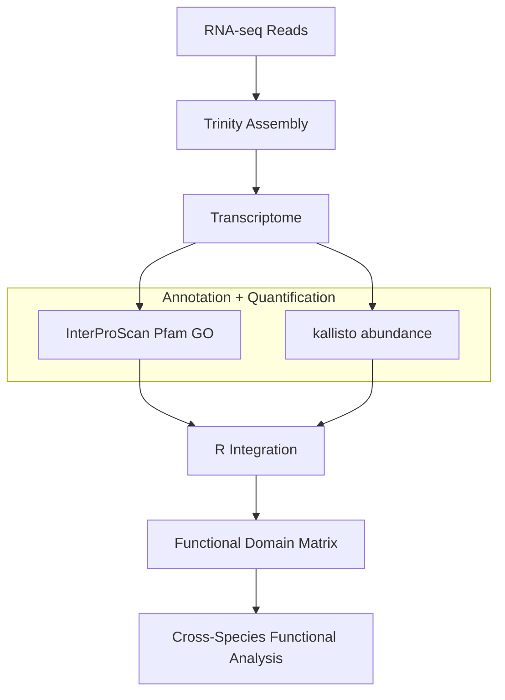

# PLANT — ParaLLeL ANNotatioN of Transcriptomes

### Mapping transcriptomes into functional protein domain space for cross-species comparison

PLANT is a comparative transcriptomics workflow that integrates **protein domain annotation** with **RNA-seq expression quantification** to construct functional expression profiles across species.

The framework treats **evolutionary divergence as a treatment condition**, allowing transcriptomes from different species to be compared through the **distribution of functional protein domains** rather than direct gene homology.

---

## Table of Contents

- [Overview](#overview)
- [Pipeline Overview](#pipeline-overview)
- [Conceptual Framework](#conceptual-framework)
- [Mathematical Interpretation](#mathematical-interpretation)
- [Normalization Strategy](#normalization-strategy)
- [Primary Use Case](#primary-use-case)
- [Input Requirements](#input-requirements)
- [Running the Analysis](#running-the-analysis)
- [Future Development](#future-development)
- [Summary](#summary)

---

## Overview

PLANT merges two complementary sources of information:

| Data source | Information captured |
|-------------|---------------------|
| InterProScan | Functional identity (Pfam domains, GO terms) |
| kallisto | Transcript abundance |

By combining these datasets, PLANT generates a **domain-weighted functional expression matrix** describing the distribution of biological functions within each transcriptome.

This representation enables **comparative functional genomics across species**, even when orthology relationships are unclear.

---

## Method Overview



The workflow consists of the following stages:

1. **RNA-seq assembly**  
   Transcriptomes are assembled from sequencing reads using **Trinity**.

2. **Functional annotation**  
   Predicted proteins are annotated using **InterProScan**, identifying Pfam domains and Gene Ontology terms.

3. **Expression quantification**  
   Transcript abundance is estimated using **kallisto**.

4. **Data integration**  
   Custom **R scripts** merge annotation results with abundance estimates to compute domain-level expression distributions.

The resulting dataset represents a **matrix of functional annotations weighted by transcript abundance**.

---

## Conceptual Framework

PLANT treats **evolutionary divergence as a treatment condition**.

Traditional comparative genomics focuses on orthologous gene comparisons. In contrast, PLANT compares **functional domain abundance profiles**, allowing biological functions to be compared even when gene homology is uncertain.

```
Functional annotation
(InterProScan)

Red crayon   → Pfam domain A+C
Green crayon → Pfam domain B
Blue crayon  → Pfam domain C


Expression quantification
(kallisto)

3 Red crayons
5 Green crayons
1 Blue crayon


PLANT integration

Domain abundance profile:

Pfam A  ███
Pfam B  █████
Pfam C  ████
```

Each species therefore becomes a **functional domain distribution**, allowing
cross-species comparison without requiring gene-level orthology.

---

## Mathematical Interpretation

PLANT aggregates transcript expression into protein domain abundance:

$$
D_j = \sum_i E_i A_{ij}
$$

Where:

- $D_j$ = abundance of protein domain *j*
- $E_i$ = expression level of transcript *i*
- $A_{ij}$ = annotation indicator (1 if transcript *i* contains domain *j*, otherwise 0)

Thus, the abundance of each protein domain is calculated by summing the expression levels of all transcripts containing that domain.

---

## Normalization Strategy

Cross-species normalization is not performed.

Typical RNA-seq normalization assumes:

- most genes are not differentially expressed
- total transcript abundance is comparable between samples

These assumptions do not hold for **comparisons across species with divergent transcriptomes**.

Instead, transcript abundance values are interpreted **within species**, where read counts represent relative transcript abundance.

---

## Primary Use Case

The pipeline is designed to identify:

- **species-specific molecular functions and transcripts**
- **unique protein domain enrichment patterns**
- **functional innovations across evolutionary lineages**

In particular, PLANT can detect transcripts encoding **protein domains that are present in one species but absent in others**.

---

## Input Requirements

The R scripts assume that the following files are available:

- **InterProScan output files**
- **kallisto abundance files**
- **species list CSV file**

Input files should follow a consistent naming convention.

---

## Running the Analysis

1. Place all input files in the same directory as the R scripts.
2. Open R or RStudio.
3. Set the working directory to the folder containing the input files.
4. Run the script line by line.

The output will produce merged annotation–expression tables suitable for downstream comparative analysis and visualization.

---

## Future Development

### Sequence Similarity Thresholding

A sequence similarity filtering method has been developed and will be
incorporated in a future update.

This method introduces a **similarity threshold parameter** that allows
users to control how strictly sequences are matched across transcriptomes.

The threshold can be adjusted from **0–100% sequence similarity**:

- **0%** — all annotated protein domains are included in the comparison  
- **Intermediate values** — only domains associated with increasingly
  similar sequences are retained  
- **100%** — only domains derived from **exact or near-exact homologs**
  are included

By gradually increasing the similarity threshold, users can observe how
functional domain distributions change as sequence similarity constraints
become more stringent.

This approach enables exploration of **inflection points in functional
similarity**, revealing where conserved protein families dominate or where
functional divergence emerges between species.

The similarity threshold acts as a **dial controlling evolutionary stringency**, allowing functional comparisons to transition smoothly from broad domain-level similarity to exact homolog matching.

---

### Single-Cell Functional Embedding via Protein Domains

A planned extension of this framework is the integration of protein domain–level annotation with single-cell RNA sequencing (scRNA-seq) analysis pipelines such as Seurat.

In contrast to the current workflow (which operates at the species or transcriptome level using tools such as kallisto), this approach would operate at the **single-cell level** by leveraging gene expression count matrices generated by Seurat.

#### Conceptual Integration

- Protein domain annotation would be performed using InterProScan on reference transcript sequences
- Instead of transcript-level quantification (e.g., kallisto), **per-cell gene expression counts from Seurat** would be used
- Domain abundances would be computed per cell by aggregating expression values across genes associated with each domain

This preserves the core principle of the pipeline—**merging annotation and quantification**—while shifting the unit of analysis from species to individual cells.

#### Visualization Concept

In the current framework, domain-based annotations are visualized as **parallel scatterplots across species**.

In the single-cell extension:

- Each cell is first embedded in a 2D space using UMAP (via Seurat)
- Domain-level annotations are computed independently for each cell
- Instead of displaying multiple plots side-by-side, **domain information is projected onto the UMAP coordinates**

This enables a visualization where:

- Each point represents a cell (as in standard UMAP plots)
- Each cell carries an associated **functional/domain profile**
- Domain-level variation can be visualized across the embedding

Conceptually, this can be extended into a **3D representation**, where:

- The UMAP embedding defines the x–y axes
- Domain abundance (or derived functional features) defines a third dimension

This transforms the current parallel annotation paradigm into a **spatially integrated functional map of single cells**.

#### Mathematical Interpretation: Functional Fields over UMAP Embeddings

We can reinterpret the original as a special case. For a single sample (or cell), let $E \in \mathbb{ℝ}^g$ denote gene expression. Domain abundances can be expressed as a linear transformation of gene expression. Let $A \in \mathbb{ℝ}^{g \times d}$ denote a mapping from genes to protein domains. Domain abundances are given by:

$$
D_k = \sum_j E_j A_{j,k}
$$

where $j$ indexes genes and $k$ indexes domains. Domain-level features arise from a structured projection of gene expression.

For multiple cells, stacking expression vectors into a matrix $X \in \mathbb{ℝ}^{n \times g}$ yields:

$$
D_{i,k} = \sum_j X_{i,j} A_{j,k}
$$

which extends the same mapping across all cells.

The proposed single-cell extension can be interpreted mathematically as defining protein domain abundances over a low-dimensional manifold learned from gene expression data.

Let:

- $X \in \mathbb{ℝ}^{n \times g}$: gene expression matrix (cells × genes)
- $D \in \mathbb{ℝ}^{n \times d}$: domain abundance matrix (cells × domains)
- $U \in \mathbb{ℝ}^{n \times 2}$: UMAP embedding (cells × 2D coordinates)

UMAP defines a nonlinear mapping:

$$
\phi: \mathbb{ℝ}^g \rightarrow \mathbb{ℝ}^2
$$

which assigns each cell $i$ a coordinate:

$$
U_i = (u_i, v_i)
$$

This embedding can be interpreted as a low-dimensional manifold capturing transcriptional similarity between cells.

For a given protein domain $k$, define a function over cells:

$$
f_k(i) = D_{i,k}
$$

By associating each value $f_k(i)$ with its corresponding UMAP coordinate $(u_i, v_i)$, we obtain a scalar function:

$$
f_k(u, v)
$$

defined over the embedded manifold.

#### Interpretation

- Each protein domain defines a **scalar field** over the UMAP embedding
- The value of the field at each point corresponds to the domain abundance in that cell
- Visualizing $(u_i, v_i, D_{i,k})$ produces a **height function** over the embedding

This provides a natural interpretation of the proposed visualization:

- The 2D UMAP defines the geometric structure of the data
- The third dimension encodes functional information derived from protein domains

#### Multiple Domains

For all domains simultaneously:

$$
f(i) = D_i \in \mathbb{ℝ}^d
$$

This defines a **vector-valued function** over the manifold, where each cell is associated with a high-dimensional functional profile.

This can be visualized by:

- selecting individual domains
- projecting $D_i$ into lower dimensions (e.g., PCA)
- computing aggregate functional scores

#### Note on Manifold Pullback

Formally, the domain functions can be interpreted via a pullback onto the UMAP embedding. Let

$$
\phi : \mathbb{ℝ}^g \to \mathbb{ℝ}^2
$$

denote the UMAP mapping from gene expression space to the embedded coordinates. Then each domain function defined on cells can be expressed over the embedding as a composition:

$$
f_k \circ \phi^{-1}
$$

This provides a mathematical interpretation of domain abundances as functions defined on the learned low-dimensional manifold. In practice, this formulation is approximate, as UMAP does not provide an explicit inverse mapping.

#### Summary

Under this formulation, the method can be viewed as constructing **functional fields over a learned transcriptional manifold**, enabling direct visualization and analysis of protein domain variation across single-cell embeddings.

#### Potential Advantages

- **Continuity with existing pipeline**
  Reuses the same annotation + quantification framework, adapted to single-cell data

- **Functional overlay on cell embeddings**
  Enables direct interpretation of UMAP clusters in terms of protein domain composition

- **Orthogonal biological signal**
  Domain-level features may reveal structure not captured by gene expression alone

- **Cross-species extensibility**
  Domain-based representations remain compatible with multi-species comparisons

#### Longer-Term Vision

- Interactive visualization of domain abundance across UMAP embeddings
- Identification of domain-level markers for cell types
- Integration with multi-modal single-cell data
- De novo cross-species single-cell comparisons

---

## Summary

PLANT transforms transcriptome data into a **quantitative distribution of functional protein domains**, enabling comparative analysis of transcriptomes in terms of **functional composition rather than gene identity**.

This approach provides a scalable framework for **comparative systems biology across evolutionary time**.